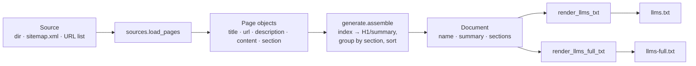

# llms-txt-generator

> Generate an `llms.txt` file for any site from local Markdown/HTML, a sitemap, or a URL list — fully offline.


## Overview

[`llms.txt`](https://llmstxt.org) is an emerging convention that helps AI
crawlers and answer engines understand a website without scraping and guessing.
It is a single Markdown file at the root of a site (`/llms.txt`) that gives an
LLM a curated map: the site name, a one-line summary, and a set of sections
linking to the pages that matter, each with a short description.

`llms-txt-generator` builds that file for you. Point it at a directory of
Markdown/HTML pages, a `sitemap.xml`, or a plain list of URLs, and it extracts a
title and a first-paragraph description from each page, groups pages into
sections, and renders a spec-shaped `llms.txt`. It also produces the
`llms-full.txt` variant — the same header followed by the full plain-text
content of every page — for tools that want everything inline.

Everything runs locally. There are no network calls; the tool only reads the
files you hand it.

## Architecture



The flow is a straight pipeline: **load → model → assemble → render**. Data
holders (`Page`, `Section`, `Document`) carry no behaviour, so each stage is
easy to test in isolation.

## The llms.txt format

A minimal `llms.txt` looks like this:

```text
# Site name

> Optional one-line blockquote summary.

## Section title

- [Page title](https://example.com/page): One-line description.
- [Another page](https://example.com/other): Its description.
```

- **H1** (`#`) — the site or project name.
- **Blockquote** (`>`) — an optional short summary.
- **H2** (`##`) — a section grouping related links.
- **List item** — `[title](url): description`, one per page.

The homepage/index page supplies the H1 and summary and is not repeated as a
link. See [llmstxt.org](https://llmstxt.org) for the full proposal.

## Features

- Three offline sources: a local directory (`.md`/`.markdown`/`.html`/`.htm`), a
  `sitemap.xml`, or a newline-delimited URL list.
- Title and description extraction: `<title>`/`<h1>` and
  `<meta name="description">`/first `<p>` for HTML; the first `#` heading and
  first prose paragraph for Markdown.
- Automatic sectioning from the first directory segment (`guides/…` → `Guides`).
- Automatic index detection (`index`, `readme`, `home`).
- Deterministic, sorted output — friendly to version control and diffs.
- Companion `llms-full.txt` with concatenated page content.
- Usable as a CLI or as a small library.

## Tech stack

- **Python 3.9+**
- **[Click](https://click.palletsprojects.com/)** — CLI wiring
- **[BeautifulSoup 4](https://www.crummy.com/software/BeautifulSoup/)** — HTML parsing
- **[pytest](https://pytest.org)** — tests
- **[ruff](https://docs.astral.sh/ruff/)** — lint + import sort

## Getting started

```bash
# 1. Install (editable, with dev extras)
pip install -e ".[dev]"

# 2. Generate from the bundled example directory
llms-txt-generator examples/site --base-url https://nimbusnotes.example --output .

# 3. Or generate from the bundled sitemap, resolving pages to local files
llms-txt-generator examples/sitemap.xml --base-dir examples/site --output .
```

Both commands write `llms.txt` and `llms-full.txt` into the output directory.

### CLI options

```text
Usage: llms-txt-generator [OPTIONS] SOURCE

  Generate an llms.txt file from SOURCE.

Options:
  -t, --source-type [auto|dir|sitemap|urllist]  How to interpret SOURCE.  [default: auto]
  -o, --output DIRECTORY                         Where to write output.    [default: .]
  -b, --base-url TEXT                            URL prefix for dir sources.
  -d, --base-dir DIRECTORY                       Resolve sitemap/URL entries to local files.
  -n, --name TEXT                                Override the H1 site name.
  -s, --summary TEXT                             Override the summary line.
  --full / --no-full                             Also write llms-full.txt.   [default: full]
  -h, --help                                     Show this message and exit.
```

## Usage

Running the tool against `examples/site` produces:

```text
# Nimbus Notes

> Nimbus Notes is a fast, offline-first note-taking app for developers who live in Markdown.

## Api

- [API Overview](https://nimbusnotes.example/api/overview.html): The Nimbus Notes HTTP API lets you read, write, and search notebooks programmatically.
- [Notebooks API](https://nimbusnotes.example/api/notebooks.md): Create, list, and delete notebooks through the /v1/notebooks resource.

## Guides

- [Getting Started](https://nimbusnotes.example/guides/getting-started.html): Install Nimbus Notes and create your first notebook in under two minutes.
- [Syncing your notes](https://nimbusnotes.example/guides/syncing.md): Nimbus Notes keeps everything on disk first and syncs on your terms. Point it
```

As a library:

```python
from llmstxt.sources import load_pages
from llmstxt.generate import generate

pages = load_pages("examples/site", source_type="dir", base_url="https://example.com")
llms_txt, llms_full_txt = generate(pages, name="Nimbus Notes")
print(llms_txt)
```

## Project structure

```text
llms-txt-generator/
├── llmstxt/
│   ├── __init__.py       # public surface + version
│   ├── models.py         # Page / Section / Document dataclasses
│   ├── sources.py        # load pages from dir / sitemap / URL list
│   ├── generate.py       # assemble + render llms.txt / llms-full.txt
│   └── cli.py            # Click entrypoint
├── examples/
│   ├── site/             # small sample site (.html + .md)
│   └── sitemap.xml       # sample sitemap referencing the sample site
├── tests/                # pytest suite (offline)
├── pyproject.toml
├── requirements.txt
├── .github/workflows/ci.yml
├── LICENSE
└── README.md
```

## Testing

```bash
pip install -e ".[dev]"
ruff check .
pytest -q
```

The suite is fully offline and deterministic: it loads the bundled
`examples/site`, then asserts the generated `llms.txt` has the expected H1,
sections, and exact `[title](url): description` link lines. CI runs the same
checks on Python 3.9, 3.11, and 3.12.

## Roadmap

- Front-matter support for explicit titles, descriptions, and section overrides.
- A config file to control section order and custom prose blocks.
- Optional token-budget trimming for `llms-full.txt`.
- JSON output for programmatic pipelines.

## License

MIT — see [LICENSE](LICENSE).

---

Part of my cloud & AI portfolio — see [github.com/matthews-wong](https://github.com/matthews-wong).
